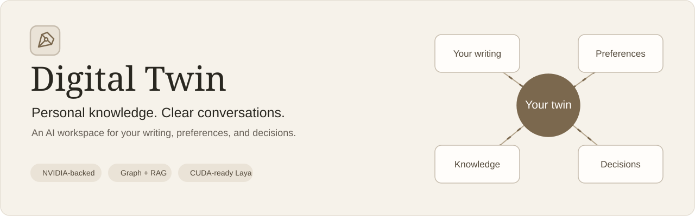
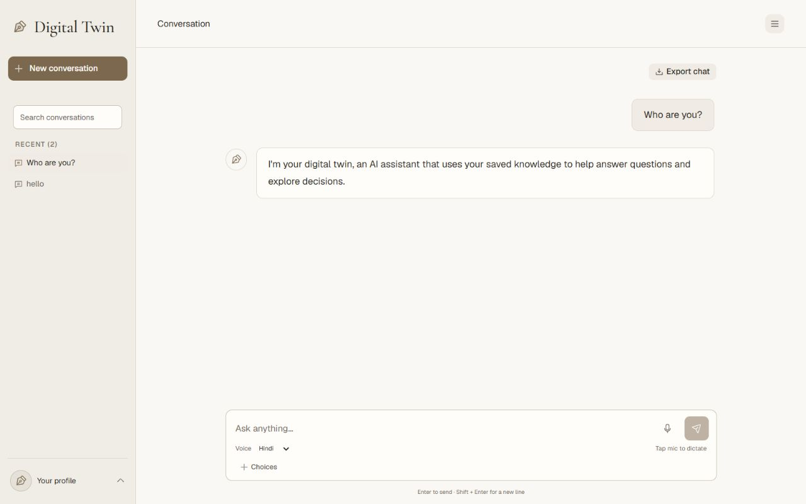
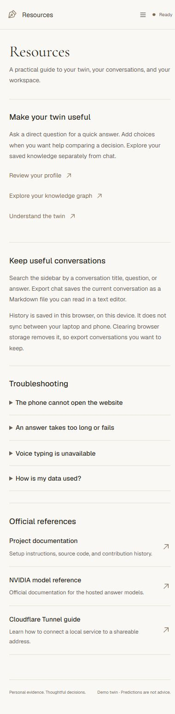
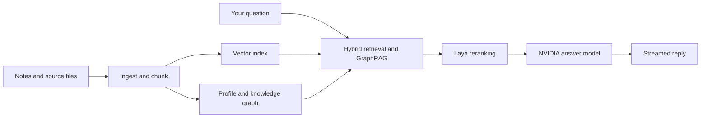

<p align="center">
  
</p>

<p align="center">
  <strong>A personal AI workspace built around your knowledge.</strong><br />
  Turn notes, journals, and conversations into a searchable profile, a knowledge graph, and grounded answers.
</p>

<p align="center">
  <a href="#workspace">Workspace</a> ·
  <a href="#quick-start">Quick start</a> ·
  <a href="#configuration">Configuration</a> ·
  <a href="#how-it-works">Architecture</a> ·
  <a href="#api">API</a>
</p>

## Workspace



<table>
<tr>
<td width="50%" valign="top">
<h3>Clear conversations</h3>
<p>Streamed replies, compact message entry, Hindi and English voice dictation, click-to-play answer readout, and optional choices for comparing decisions. Personal reports stay outside the chat view.</p>
</td>
<td width="50%" valign="top">
<h3>Connected knowledge</h3>
<p>Hybrid vector retrieval and GraphRAG connect relevant source fragments, entities, and communities. Explore the profile and graph through the profile menu.</p>
</td>
</tr>
<tr>
<td width="50%" valign="top">
<h3>Your workspace, your style</h3>
<p>Warm Ivory, Cool Slate, Soft Sage, and Evening themes. Adjustable text size, graph palettes, reduced motion, optional response timings, and reply notifications.</p>
</td>
<td width="50%" valign="top">
<h3>Keep the useful parts</h3>
<p>Search saved conversations, rename or archive sessions, and export readable Markdown. Resources includes usage guides, troubleshooting, and official references.</p>
</td>
</tr>
</table>

<details>
<summary><strong>See the mobile resources page</strong></summary>
<br />

</details>

## Quick start

**Requirements:** Python 3.10+, Node.js and npm, and sufficient memory for the local embedding and Laya models. CUDA is optional and requires a compatible NVIDIA GPU and CUDA-enabled PyTorch installation. CPU mode is available.

The commands below use **Windows PowerShell**. On Linux/macOS, activate the environment with `source .venv/bin/activate` and use `cp` instead of `Copy-Item`.

### Install

```powershell
git clone https://github.com/ShlokShah01/digital-twin.git
cd digital-twin
python -m venv .venv
.\.venv\Scripts\Activate.ps1
python -m pip install -e ".[dev]"
Copy-Item .env.example .env
npm --prefix web ci
npm --prefix web run build
```

### Configure and build

Add your NVIDIA API key to `.env` using the configuration below. The generated **Alex Carter demo is fictional**; start with it before adding your own material.

```powershell
digital-twin demo
digital-twin build --data data/raw/demo --no-llm
digital-twin serve --host 127.0.0.1 --port 8000
```

Open **http://127.0.0.1:8000/#/chat**. `--no-llm` builds the demo using local extraction; it does not disable configured hosted-model chat. For LLM-assisted extraction of your own files, omit that flag:

```powershell
digital-twin build --data path/to/your/files
digital-twin ask "New laptop?" --options "Buy new;Buy refurbished;Wait"
digital-twin profile
```

First startup may download model weights. Later starts reuse the local cache. The server warms Laya and embeddings before accepting chats.

## Configuration

Keep credentials in your local `.env`; **never commit them**. `.env.example` contains the supported settings without keys.

```dotenv
OPENAI_API_KEY=your_first_nvidia_key
OPENAI_API_KEY_2=your_optional_second_key
OPENAI_BASE_URL=https://integrate.api.nvidia.com/v1
DIGITAL_TWIN_LLM_MODEL=nvidia/nemotron-3-super-120b-a12b
DIGITAL_TWIN_LLM_FALLBACK_MODEL=openai/gpt-oss-20b
DIGITAL_TWIN_LLM_TIMEOUT=20
DIGITAL_TWIN_LLM_ATTEMPT_TIMEOUT=10
DIGITAL_TWIN_LLM_RPM=40
DIGITAL_TWIN_LLM_THINKING=false
DIGITAL_TWIN_LAYA_DEVICE=cpu
```

Set `DIGITAL_TWIN_LAYA_DEVICE=cuda` after installing compatible CUDA-enabled PyTorch. Check `/api/health` for the actual loaded Laya device. The embedding model uses FastEmbed/ONNX; the answer model runs on the configured hosted provider.

| Setting | Behavior |
| --- | --- |
| Two API keys | Round-robin starting slots, each with a local rolling-minute request limit |
| Primary + fallback | Streamed chat switches model and key after a primary failure |
| `DIGITAL_TWIN_LLM_RPM=40` | Local cap per key; provider/account limits still apply |
| `DIGITAL_TWIN_NO_LLM=1` | Offline extraction and decision signals; no free-form hosted narrative |
| `DIGITAL_TWIN_NO_LAYA=1` | Skip Laya reranking and decision signals |
| `DIGITAL_TWIN_RAW_DIR` | Source directory; defaults to `data/raw` |

Restart the backend after changing `.env`. Model availability and response times vary. A 2026-10-01 fictional-data check through the configured Super client completed in **1.07–4.08 seconds**; this is a synthetic measurement, not a response-time guarantee.

## How it works



1. **Ingest:** read text, Markdown, JSON, and CSV; chunk and embed with `BAAI/bge-small-en-v1.5`.
2. **Understand:** extract preferences, decision patterns, style signals, entities, and relationships. Offline builds use heuristic extraction.
3. **Connect:** store vectors in LanceDB and graph relationships in NetworkX, with community context for GraphRAG.
4. **Answer:** retrieve evidence, rerank with Laya, and generate a concise reply. Choice questions also compare Laya's decision signals with the LLM's interpretation.

Laya is a cross-check, not a guarantee of a person's future decisions. The checkpoint can emit a temperature-calibration warning; affected confidence values should be treated as uncalibrated. Chat displays the answer while technical metadata remains available through the API.

## Development and testing

```powershell
# Backend tests use local fixtures and mocked providers.
python -m pytest

# Frontend regression checks.
node --test web/src/api.test.js web/src/lib/preferences.test.js web/src/lib/history.test.js web/src/lib/voice.test.js

# Frontend development server; run the backend separately on port 8000.
npm --prefix web run dev

# Rebuild the frontend served by FastAPI.
npm --prefix web run build
```

| Directory | Purpose |
| --- | --- |
| `src/digital_twin/` | FastAPI backend, retrieval, GraphRAG, model clients, and CLI |
| `web/` | React/Vite frontend and browser-side conversation tools |
| `tests/` | Backend regression tests and local provider mocks |
| `data/raw/` | Local source documents; excluded from Git |
| `data/twin/` | Generated index, graph, profile, and server logs; excluded from Git |

## API

Interactive API documentation is available at **http://127.0.0.1:8000/docs** while the server is running.

| Method | Endpoint | Purpose |
| --- | --- | --- |
| GET | `/api/health` | Model configuration, build status, and actual Laya device |
| GET | `/api/profile` | Learned profile summary |
| GET | `/api/graph` | Knowledge graph and communities |
| POST | `/api/ask` | Complete answer for a question and optional choices |
| POST | `/api/ask/stream` | NDJSON answer stream |
| POST | `/api/build` | Rebuild the twin from source files |
| POST | `/api/ingest` | Add a source file incrementally |

```json
{"question": "Which laptop would I choose?", "options": ["Buy new", "Buy refurbished", "Wait"]}
```

## Privacy and sharing

- Source documents and generated twin data stay in local project storage. Hosted-model requests send the question and relevant retrieved context to the configured provider.
- Conversation history and appearance settings are saved in the current browser. They do not sync between devices. Export important chats before clearing browser storage.
- To open the app from a phone on the same Wi-Fi, serve with `--host 0.0.0.0` and use `http://YOUR_LAPTOP_IP:8000/#/chat`. The laptop must stay running and its firewall must allow the connection.
- The backend has **no built-in authentication**. Protect access before exposing it publicly: profile, graph, ingestion, and build routes are available to anyone who can reach it.
- A Vercel frontend needs a separately reachable backend. This project does not include an always-on hosted GPU deployment.

## Resources

- [Project usage and troubleshooting](http://127.0.0.1:8000/#/resources) — available when the local app is running.
- [NVIDIA model reference](https://docs.api.nvidia.com/nim/reference/models-1)
- [Cloudflare Tunnel documentation](https://developers.cloudflare.com/tunnel/get-started/quick-tunnels/)
- [Configuration template](.env.example)

Screenshots show the existing Warm Ivory workspace. Documentation artwork and captures are stored in `docs/assets/`; they contain no API keys or private twin evidence.
