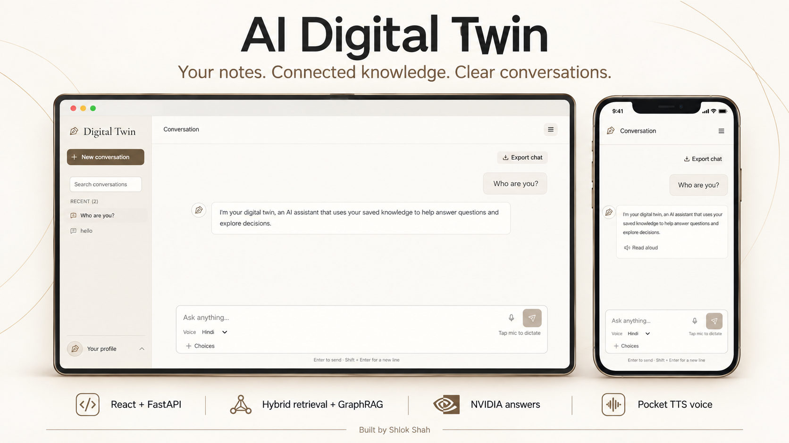
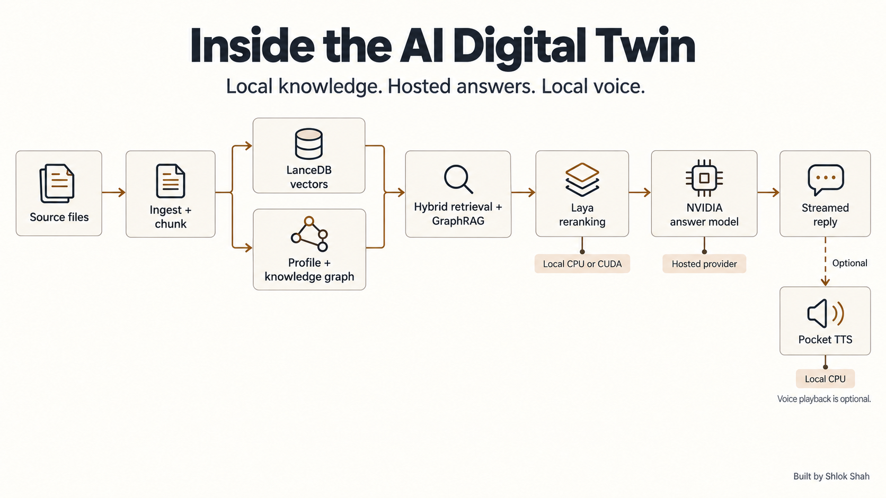
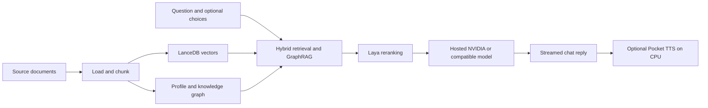

<h1 align="center">AI Digital Twin</h1>

<p align="center">
  
</p>

<p align="center">
  <strong>Turn your saved writing into connected knowledge, clear answers, and optional voice.</strong><br />
  Search your knowledge, explore decision patterns, and talk to a twin grounded in your saved material.
</p>

<p align="center">
  
  
  
  
</p>

<p align="center">
  <a href="#workspace">Workspace</a> · <a href="#quick-start">Quick start</a> ·
  <a href="#configuration">Configuration</a> · <a href="#architecture">Architecture</a> ·
  <a href="#natural-read-aloud-audio">Voice</a> · <a href="#troubleshooting">Troubleshooting</a>
</p>

## Project repository

**[ShlokShah01/digital-twin](https://github.com/ShlokShah01/digital-twin)** is the main repository for the complete application. It contains the React frontend, FastAPI backend, retrieval pipeline, Laya integration, and Pocket TTS speech service.

A repository link opens the source code. To use the running app, start the backend and open `http://127.0.0.1:8000/#/chat` on your laptop, or the laptop's current local-network address on your phone. See [Phone and laptop access](#phone-and-laptop-access). A public website deployment is separate from storing code on GitHub.

## Workspace



*Product illustration composed from fictional chat screenshots. See the original desktop capture below.*

<details>
<summary><strong>View the original desktop screenshot</strong></summary>


</details>

<table>
<tr>
<td width="50%" valign="top">
<h3>Clear conversations</h3>
<p>Streamed replies, compact message entry, Hindi and English voice typing, and optional choices for comparing decisions. Chat shows the answer; profile reports live on separate pages.</p>
</td>
<td width="50%" valign="top">
<h3>Connected knowledge</h3>
<p>Hybrid vector retrieval and GraphRAG connect source fragments, entities, and communities. Explore a learned profile and knowledge graph through the profile menu.</p>
</td>
</tr>
<tr>
<td width="50%" valign="top">
<h3>Audio when you want it</h3>
<p>Tap Read aloud below a reply to hear locally generated Pocket TTS speech. Choose Alba, Marius, or Anna. Playback is off until requested; tap again to stop.</p>
</td>
<td width="50%" valign="top">
<h3>Your workspace, your style</h3>
<p>Warm Ivory, Cool Slate, Soft Sage, and Evening themes. Adjust text size, graph colors, motion, response timings, and reply notifications in Settings.</p>
</td>
</tr>
<tr>
<td width="50%" valign="top">
<h3>Keep useful conversations</h3>
<p>Search conversation titles, questions, and answers. Rename or archive sessions and export readable Markdown. Browser history stays on the current device.</p>
</td>
<td width="50%" valign="top">
<h3>A consistent identity</h3>
<p>A custom digital pen favicon matches the workspace logo. The animated README banner traces the knowledge connections and respects reduced motion. In-app motion can be disabled.</p>
</td>
</tr>
</table>

<details>
<summary><strong>See the mobile workspace</strong></summary>
<br />

</details>

**Project status:** the app runs locally and can be opened on another device on the same network. The repository is public; a permanently hosted public chat service is not included. The sample twin is fictional, not a verified reconstruction of a real person.

## Quick start

### Requirements

| Component | Requirement |
| --- | --- |
| Python | 3.10+; the local project was checked with Python 3.14.7 |
| Node.js and npm | A version compatible with the lockfile; the local build was checked with Node 24.21.0 |
| Memory and storage | Space for downloaded Laya, embedding, and Pocket TTS weights, plus your local index |
| Internet | Needed for first model downloads and hosted-model chat |
| NVIDIA GPU | Optional for Laya; requires a compatible CUDA-enabled PyTorch build |
| API key | Required for hosted free-form answers; keep it in `.env` |

The commands below use **Windows PowerShell** and call the virtual environment directly, so activation is optional. On Linux/macOS, use `.venv/bin/python` in place of `.venv\Scripts\python.exe` and `cp` instead of `Copy-Item`.

### 1. Install

```powershell
git clone https://github.com/ShlokShah01/digital-twin.git
cd digital-twin
python -m venv .venv
.\.venv\Scripts\python.exe -m pip install -e ".[dev,tts]"
Copy-Item .env.example .env
npm --prefix web ci
npm --prefix web run build
```

Copy `.env.example` only on a fresh setup. Preserve your existing `.env` when updating an installed project. The `tts` extra installs Pocket TTS; omitting it keeps CLI-only installations lighter.

### 2. Configure the answer provider

Edit `.env` and set `OPENAI_API_KEY`. A second key is optional. The example file uses an OpenAI-compatible NVIDIA endpoint and includes the current project model configuration. See [Configuration](#configuration) for the complete settings.

### 3. Build the fictional demo

```powershell
.\.venv\Scripts\python.exe -m digital_twin.cli demo
.\.venv\Scripts\python.exe -m digital_twin.cli build --data data/raw/demo --no-llm
```

The generated **Alex Carter dataset is fictional**. `--no-llm` uses local extraction for this build; it does not disable configured hosted-model chat. Your real notes are optional and should stay outside Git.

### 4. Start the website

On Windows, double-click **[start-website.bat](start-website.bat)** from the repository root. It launches the local server in the background, waits for its API, and opens the chat. It expects the virtual environment, frontend build, and twin data from the steps above.

Or run the backend in a terminal:

```powershell
.\.venv\Scripts\python.exe -m digital_twin.cli serve --host 127.0.0.1 --port 8000
```

Open **http://127.0.0.1:8000/#/chat**. The first startup may download weights. The server warms Laya and embeddings before accepting requests and attempts to warm Pocket TTS; a speech initialization failure does not disable chat.

## Phone and laptop access

To open the same backend on your phone, serve on all local interfaces:

```powershell
.\.venv\Scripts\python.exe -m digital_twin.cli serve --host 0.0.0.0 --port 8000
ipconfig
```

Use the laptop's active Wi-Fi IPv4 address, for example `http://192.168.1.37:8000/#/chat`. That example address is specific to the current local network and can change.

- Connect both devices to the same network and keep the laptop awake.
- `localhost` and `127.0.0.1` refer to the device opening the link, so they do not point a phone at your laptop.
- The firewall must allow TCP port 8000 from your local network. Guest Wi-Fi isolation can block access even when both devices use the same Wi-Fi name.
- Conversation history and settings are stored separately in each browser, so they do not sync between devices.
- Some mobile browsers require HTTPS for microphone permission. Typed chat and read-aloud playback are independent of voice typing.

## Configuration

Keep credentials in your local `.env`. **Never put keys in the frontend, screenshots, issues, or Git history.** The repository excludes `.env`, raw documents, generated twin data, downloaded environments, and logs.

```dotenv
OPENAI_API_KEY=your_first_nvidia_key
OPENAI_API_KEY_2=your_optional_second_key
OPENAI_BASE_URL=https://integrate.api.nvidia.com/v1
DIGITAL_TWIN_LLM_MODEL=nvidia/nemotron-3-super-120b-a12b
DIGITAL_TWIN_LLM_FALLBACK_MODEL=openai/gpt-oss-20b
DIGITAL_TWIN_LLM_TIMEOUT=20
DIGITAL_TWIN_LLM_ATTEMPT_TIMEOUT=10
DIGITAL_TWIN_LLM_RPM=40
DIGITAL_TWIN_LLM_THINKING=false
DIGITAL_TWIN_LAYA_DEVICE=cpu
```

These are the checked-in example values. Model names and provider availability can change; this project does not claim that one hosted model is always the fastest.

### Models and request budgets

| Setting | Purpose |
| --- | --- |
| `OPENAI_API_KEY`, `OPENAI_API_KEY_2` | One or two server-side keys; round-robin starting slots with per-key local limits |
| `OPENAI_BASE_URL` | OpenAI-compatible API endpoint, including `/v1` where the provider requires it |
| `DIGITAL_TWIN_LLM_MODEL` | Primary hosted answer model |
| `DIGITAL_TWIN_LLM_FALLBACK_MODEL` | Independent fallback model for failed primary requests |
| `DIGITAL_TWIN_LLM_RPM` | Rolling-minute local cap per key; provider and account limits still apply |
| `DIGITAL_TWIN_LLM_TIMEOUT` | Overall provider retry deadline in seconds |
| `DIGITAL_TWIN_LLM_ATTEMPT_TIMEOUT` | Budget for an individual provider attempt |
| `DIGITAL_TWIN_LLM_THINKING` | Thinking mode for compatible models; disabled in the example for interactive chat |
| `DIGITAL_TWIN_LLM_CONTEXT` | Input context budget; example 131072 tokens |
| `DIGITAL_TWIN_EMBED_MODEL` | Embedding model; default `BAAI/bge-small-en-v1.5` |
| `DIGITAL_TWIN_LAYA_CHECKPOINT` | Laya checkpoint; default `typed-decisions` |
| `DIGITAL_TWIN_LAYA_DEVICE` | `cpu` by default; set `cuda` for a compatible NVIDIA/PyTorch installation |
| `DIGITAL_TWIN_NO_LLM=1` | Disable hosted extraction and narrative generation |
| `DIGITAL_TWIN_NO_LAYA=1` | Skip Laya reranking and decision signals |

Restart the backend after changing `.env`. Streaming provides text before the full response finishes. The current fallback switches model and key after a primary failure; it does not remove the provider's quotas or guarantee a one-second answer.

### Data and retrieval

| Setting | Default | Purpose |
| --- | --- | --- |
| `DIGITAL_TWIN_RAW_DIR` | `data/raw` | Input source directory |
| `DIGITAL_TWIN_DIR` | `data/twin` | Generated profile, graph, vector index, and logs |
| `DIGITAL_TWIN_CHUNK_WORDS` | 150 | Approximate words per chunk |
| `DIGITAL_TWIN_CHUNK_OVERLAP` | 30 | Overlap between adjacent chunks |
| `DIGITAL_TWIN_VECTOR_K` | 256 | Initial vector candidates |
| `DIGITAL_TWIN_GRAPH_K` | 12 | Graph retrieval budget |
| `DIGITAL_TWIN_RETRIEVE_K` | 24 | Combined retrieval budget |
| `DIGITAL_TWIN_RERANK_K` | 6 | Final reranked evidence budget |
| `DIGITAL_TWIN_COMMUNITY_K` | 3 | Selected community summaries |
| `DIGITAL_TWIN_MAX_COMMUNITIES` | 12 | Community summary cap |

Start with the defaults. Change retrieval budgets only after measuring the effect on your own dataset.

## GPU and CPU responsibilities

| Work | Device or location |
| --- | --- |
| Laya reranking and decision signals | CPU or CUDA, according to configuration and installed PyTorch |
| Embeddings | Local FastEmbed/ONNX runtime |
| Answer generation | Configured hosted model provider |
| Pocket TTS | Local CPU, intentionally independent of CUDA |
| UI and stored conversation history | Current browser |

For CUDA, install a PyTorch build compatible with your hardware using the [official PyTorch installation guide](https://pytorch.org/get-started/locally/), then set `DIGITAL_TWIN_LAYA_DEVICE=cuda`. Check the loaded device through `/api/health`, not only the value in `.env`:

```powershell
Invoke-RestMethod http://127.0.0.1:8000/api/health |
  Select-Object laya_enabled, laya_loaded, laya_device, speech
```

Installing CPU speech dependencies does not require replacing a working CUDA PyTorch installation.

## Architecture





1. **Load:** normalize supported source files into documents and chunks.
2. **Index:** embed chunks and store vectors in LanceDB.
3. **Connect:** derive preferences, decision patterns, style signals, entities, relationships, and community context. Offline builds use heuristic extraction.
4. **Retrieve:** combine vector and graph context, then apply Laya reranking when enabled.
5. **Answer:** generate a concise reply using the configured provider. Optional choices expose decision signals through the API while chat remains focused on the answer.
6. **Speak:** generate English audio locally when Read aloud is requested.

Laya is a cross-check, not a guarantee of a person's future decisions. Its checkpoint can emit a temperature-calibration warning; affected confidence values should be treated as uncalibrated. A learned profile represents available source material, including omissions and contradictions.

## Add your own knowledge

Supported sources include `.txt`, `.md`, `.markdown`, `.rst`, `.org`, `.json`, `.jsonl`, `.ndjson`, `.csv`, and `.tsv`. JSON conversation loading uses heuristics; review the resulting profile when importing chat exports.

```powershell
# Build using your own source directory.
.\.venv\Scripts\python.exe -m digital_twin.cli build --data "C:/path/to/your/notes"

# Inspect the profile locally.
.\.venv\Scripts\python.exe -m digital_twin.cli profile

# Ask through the CLI, with optional choices.
.\.venv\Scripts\python.exe -m digital_twin.cli ask "Which laptop would I choose?" --options "Buy new;Buy refurbished;Wait"
```

Use `build --no-llm` for local heuristic extraction. Hosted extraction and chat can transmit source context to the configured provider. Add only material you are authorized to use.

## Natural read-aloud audio

Click **Read aloud** beneath a reply; click again to stop. In **Settings → Read-aloud voice**, choose Alba (conversational), Marius, or Anna. Playback stays off until requested and uses 70% volume without artificial pitch or speed changes.

[Pocket TTS 3.3.0](https://github.com/kyutai-labs/pocket-tts) generates audio locally on **CPU**; Laya can continue using CUDA. Install the `tts` extra above. The first startup downloads public model weights and voice conditioning; later starts reuse the Hugging Face cache. Chat remains available if speech cannot load.

Calibration follows the [official English model configuration](https://github.com/kyutai-labs/pocket-tts/blob/main/pocket_tts/config/english_2026-09.yaml): **temperature 0.3**, **one decoding step**, no noise clamp, EOS threshold −4. Kyutai reports that human evaluation preferred temperature 0.3. This app uses CPU INT8 quantization and four PyTorch threads after local speed checks. Alba uses a voice-acted casual reference; naturalness and accent are subjective, so compare the three voices in Settings.

A fictional short local sample generated about **3.92 seconds of speech in 1.90 seconds** with INT8/four threads. The app buffers the WAV before playback to avoid gaps; this is not a first-audio latency guarantee. Longer replies take longer. Repeated identical replies use a bounded eight-entry RAM cache. One generation runs at a time; stopping cancels playback/download, but an in-progress CPU generation finishes before another can start.

The selected model supports **English speech**. Hindi dictation still works, but Hindi read-aloud needs a separate language model and returns a clear message here. Browser voice synthesis is no longer used. Audio is mono 24 kHz PCM WAV and is not saved to project storage.

Voice reference credits: [Kyutai voice catalog](https://huggingface.co/kyutai/tts-voices). Alba: Alba MacKenna, CC BY 4.0. Marius: donated reference, CC0. Anna: VCTK p228 reference, CC BY 4.0; see the catalog's VCTK attribution and licenses. These references are shipped as cached model conditioning, not committed into this repository.

## API

Interactive API documentation is available at **http://127.0.0.1:8000/docs** while the server is running.

| Method | Endpoint | Purpose |
| --- | --- | --- |
| GET | `/api/health` | Index status, configured answer model, loaded Laya device, and speech status |
| GET | `/api/profile` | Learned profile summary |
| GET | `/api/graph` | Knowledge graph and communities |
| POST | `/api/ask` | Complete answer for a question and optional choices |
| POST | `/api/ask/stream` | NDJSON stream with status, text, answer, or error events |
| POST | `/api/speech` | Local WAV generation; maximum 4000 characters; alba/marius/anna voice |
| POST | `/api/build` | Rebuild the twin from source files |
| POST | `/api/ingest` | Incrementally ingest a source file by backend-local path |

Example chat request:

```powershell
$body = @{ question = "Which laptop would I choose?"; options = @("Buy new", "Buy refurbished", "Wait") } | ConvertTo-Json
Invoke-RestMethod http://127.0.0.1:8000/api/ask -Method Post -ContentType 'application/json' -Body $body
```

Example speech body:

```json
{"text": "Hello. Let us compare your options.", "voice": "alba"}
```

Speech returns `audio/wav` with `Cache-Control: no-store`. Invalid input returns 422, a busy speech worker returns 429 with `Retry-After`, and unavailable speech returns a sanitized 503. A provider failure remains visible in chat with Retry; it is not presented as a successful answer.

## Development and validation

```powershell
# Local backend tests use fixtures and mocked answer providers.
.\.venv\Scripts\python.exe -m pytest

# Browser-independent frontend regression checks.
node --test web/src/api.test.js web/src/lib/preferences.test.js web/src/lib/history.test.js web/src/lib/voice.test.js

# Frontend development; keep the backend running separately on port 8000.
npm --prefix web run dev

# Build the production assets served by FastAPI.
npm --prefix web run build
```

Vite proxies `/api` to the local backend during development. Production serves the built frontend and API from one origin. The pen favicon is a repository-native SVG in `web/src/assets/twin-mark.svg`; Vite resolves it as part of the build. The animated banner uses SVG/CSS with a static reduced-motion state.

For backend changes, run focused tests for the affected route or model helper. Speech contract tests use a fake model and do not download weights. Live provider latency checks should use fictional data and report the hardware and provider context.

### Project layout

```text
digital-twin/
├── start-website.bat       Windows launcher
├── .env.example           Configuration without credentials
├── src/digital_twin/       Backend, models, retrieval, ingestion, and CLI
│   ├── server.py          FastAPI routes and startup warm-up
│   ├── engine.py          Twin answering pipeline
│   ├── llm.py             Provider clients, limits, retries, and streaming
│   └── speech.py          Local Pocket TTS and bounded audio cache
├── web/                   React/Vite interface
│   ├── src/assets/        Custom pen favicon
│   ├── src/views/         Chat, profile, graph, settings, and resources
│   └── src/lib/           Conversation, preference, and speech helpers
├── tests/                 Backend contract checks and mocked providers
├── docs/assets/           Public screenshots and animated banner
├── data/raw/              Local source material, excluded from Git
└── data/twin/             Generated twin data and logs, excluded from Git
```

## Troubleshooting

| Symptom | Check and recovery |
| --- | --- |
| Website does not open | Confirm the backend is running and port 8000 is available. Run the CLI in a terminal to see startup errors. |
| Launcher fails | Finish installation and frontend build first. Read `data/twin/server.stderr.log` and `server.log`. The launcher leaves another application's occupied port untouched. |
| App says build needed | Generate the fictional demo and build it, or build your own source directory. Generated data is intentionally absent from Git. |
| Free-form answer needs an LLM key | Set a valid server-side key in `.env`, check the base URL/model, and restart. An offline choice prediction does not replace hosted narrative generation. |
| Answer is slow or temporarily unavailable | Check provider availability, account limits, timeouts, and fallback model. Enable response timings in Settings to measure completed replies. |
| Laya reports CPU | Check CUDA-enabled PyTorch and device compatibility, set `DIGITAL_TWIN_LAYA_DEVICE=cuda`, restart, and inspect actual health status. |
| Read aloud is unavailable | Install the `tts` extra, allow the first weight download, and inspect `speech.loaded` in health and the server logs. |
| Hindi reply cannot be spoken | The configured Pocket TTS model voices English. Hindi dictation remains separate. |
| Speech worker is busy | Wait for the previous synthesis to finish and retry. Stopping playback does not interrupt CPU synthesis already running. |
| Phone cannot connect | Use the current laptop IPv4 address, same-network access, and a narrow local firewall rule. Keep the laptop awake. |
| Microphone is unavailable | Use a compatible browser, allow microphone access, and use HTTPS where required by the browser. |
| UI looks outdated after a pull | Run `npm --prefix web ci` and `npm --prefix web run build`, then refresh the browser. |
| History differs on the phone | History and preferences are local to each browser. Export important conversations before clearing storage. |

## Privacy, hosting, and limitations

- **Local storage:** source documents, generated indices, profile files, and logs stay on the backend machine. Browser conversation history and preferences stay in that browser.
- **Hosted inference:** with a hosted model enabled, questions and relevant retrieved context are sent to the configured provider. This is not fully offline chat.
- **Local speech:** Pocket TTS generates the requested answer audio on CPU. WAV results use a bounded RAM cache and are not written to project storage.
- **Public access:** the backend has no built-in authentication. Profile, graph, ingestion, and build routes are reachable by anyone who can reach the server. Add access control before internet exposure.
- **GitHub Pages:** can host a static interface, but cannot run this Python backend, local models, or Pocket TTS. A working public chat service needs a separately reachable backend.
- **Vercel:** a frontend deployment still needs a backend that can run the Python/model workload. This repository is not an always-on hosted GPU service.
- **Availability:** local links require a running laptop. Hosted API quotas and infrastructure limits apply; unlimited free usage and constant one-second responses are not guaranteed.
- **Predictions:** the twin is a software interpretation of available evidence. It does not establish a person's identity or guarantee their choices.

## Contributing

Keep changes focused, run the relevant checks, and include a screenshot for visible UI changes. Use fictional test material. Never commit API keys, browser credentials, real journals, model caches, or generated private profiles. Do not add dependencies when existing code or the standard library covers the change.

## Official references and credits

- [NVIDIA model reference](https://docs.api.nvidia.com/nim/reference/models-1)
- [Pocket TTS source and documentation](https://github.com/kyutai-labs/pocket-tts)
- [Pocket TTS voice reference licenses](https://huggingface.co/kyutai/tts-voices)
- [PyTorch installation guide](https://pytorch.org/get-started/locally/)
- [GitHub Pages capabilities](https://docs.github.com/en/pages/getting-started-with-github-pages/what-is-github-pages)
- [Project configuration template](.env.example)

Documentation artwork and screenshots contain fictional conversations and public interface elements. Product and architecture images were created with imagegen; the [prompt set](docs/imagegen-prompts.md) records the brief. The pen favicon and animated banner are authored SVG assets. Voice reference attribution and speech calibration details are documented in the read-aloud section above.
